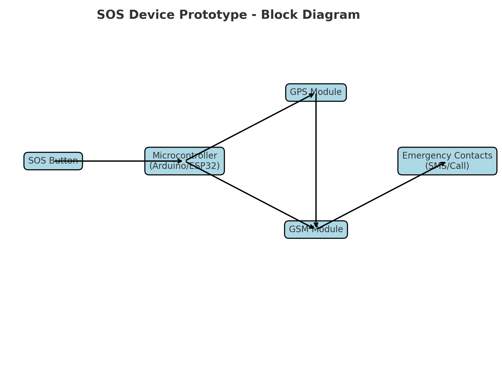

# 🚨 SOS Device Prototype
Affordable wearable SOS device for families to alert in emergencies.

---

## 📌 Overview
The **SOS Device Prototype** is a low-cost wearable designed for emergency situations such as floods, kidnapping, or accidents.  
By pressing a button, the device triggers:  
- 🔊 Buzzer alarm  
- 💡 LED alert  
- 📍 GPS location tracking (prototype uses demo coordinates)  
- 📲 GSM/SMS alert to family or rescue team  

The vision is to make **safety accessible for every family** in India and worldwide, while also exploring **premium and military-grade versions**.  

---

## ✨ Features (Current)
- Arduino-based prototype  
- Push button to activate SOS  
- Buzzer + LED alert  
- GPS tracking (demo coordinates in prototype)  
- GSM/SIM module for sending SMS alerts  
- Main SOS program that integrates all features  

---

## 🔮 Future Features (Planned)
- Real-time GPS + GSM integration with live location  
- Cloud server for parents + government monitoring  
- Mobile app for alerts and tracking  
- Waterproof design for flood rescue  
- Bracelet, necklace, and pocket-size premium versions  

---

## 🛠️ Project Structure
├── docs/              # Documentation (diagrams, notes, research) ├── src/               # Source code (Arduino sketches) ├── LICENSE            # License information ├── README.md          # Project overview └── .gitignore         # Ignored files

---

## 📊 System Design
Here’s the block diagram of the SOS Device prototype:  

---

## 🧪 Simulation
Prototype can be tested on [Tinkercad Circuits](https://www.tinkercad.com/) (simulation link will be added soon).  

First version uses:  
- Arduino Uno  
- Push Button  
- Buzzer  
- LED  

---

## 🌍 Why This Project?
In India and many countries, the **per capita income is low** but the need for affordable safety devices is high.  
This project aims to **save lives** in disasters (like floods) and emergencies, while being **cost-friendly for families**.  

Long-term vision:  
- 🚀 Expand to premium military use  
- 🌍 Collaborate with governments and universities (like NUS Singapore)  
- 💡 Inspire more students to build real-world safety solutions  

---

## 👤 Author
**Md Naved Ansari**  
- Aspiring Computer Science student  
- Passionate about robotics, safety tech, and innovation  
- Dream: To study at NUS and build life-saving technology
